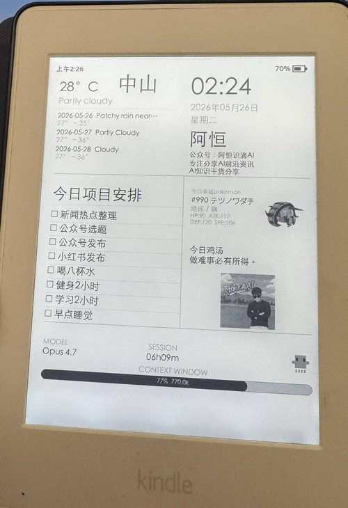

# Kindle Desk Card · 墨水屏桌面副屏


把越狱 Kindle Paperwhite 3 变成桌面 ambient 副屏。Mac 端 Python 渲染 widget 图片，SSH 推送到 Kindle 墨水屏显示。

天气、时间、待办、宝可梦、鸡汤、Claude 状态——瞥一眼就知道今天的状态。

```
Mac (Python 渲染) ──SSH──▶ Kindle (帧缓冲) ──▶ 墨水屏显示
```

## 效果展示



## 功能特点

- 🖥 **桌面 ambient 副屏** — 1072×1448 墨水屏立在显示器旁，低疲劳感
- 🎨 **服务端渲染** — Python + Pillow 渲染像素帧，Kindle 只负责显示
- 📦 **6 种 widget** — 天气、时间日期、待办事项、宝可梦、鸡汤语录、Claude 状态
- 🔄 **定时刷新** — daemon 模式自动循环推送
- 🔌 **SSH 推送** — 本地网络直连，无云依赖
- 💤 **墨水屏特性** — 不刺眼、不抢注意力、静态显示 0 功耗

## 硬件准备

| 项目 | 说明 |
|------|------|
| **Kindle Paperwhite 3** | 已越狱，安装了 KOReader + FBInk |
| USBNetwork / Wi-Fi | Kindle 开启 SSH 访问 |
| SSH 密钥 | 用于无密码登录 Kindle |
| Mac / Linux | 运行 Python 渲染端 |

### Kindle 越狱环境

确保你的 Kindle 已完成：

1. **越狱** — 安装 MobileRead Package Manager (MRPV)
2. **KOReader** — 安装 [KOReader](https://koreader.rocks/) 阅读器
3. **FBInk** — KOReader 自带的帧缓冲墨水屏刷新工具
4. **USBNetwork** — 通过 Wi-Fi 或 USB 网络访问 Kindle SSH

## 安装

### 1. 克隆项目

```bash
git clone https://github.com/keihang/kindle-desk-card.git
cd kindle-desk-card
```

### 2. 创建虚拟环境

```bash
python3 -m venv .venv
source .venv/bin/activate
```

### 3. 安装依赖

```bash
pip install -r requirements.txt
```

### 4. 配置

编辑 `config.yaml`：

```yaml
kindle:
  host: "192.168.1.35"  # 以 Kindle ;711 页面显示的当前 IP 为准
  port: 22
  user: "root"
  key_path: "~/.ssh/kindle_usb_rsa"  # SSH 密钥路径，USBNetwork 实测优先用 RSA
  fbink_path: "/mnt/us/koreader/fbink"  # FBInk 路径

refresh_interval: 600  # 刷新间隔（秒）

weather:
  city: "Zhongshan"  # 城市名（英文）

display:
  waveform: "GC16"  # 墨水屏刷新模式
  avatar_path: ""  # 头像图片路径（可选）
```

### 5. 测试连接

```bash
ssh -i ~/.ssh/kindle_usb_rsa root@192.168.1.35 "echo 'Connected!'"
```

### 6. Kindle 侧正确状态

实测要满足这几个条件，Mac 侧才连得上：

1. Kindle 已连上当前 Wi-Fi
2. 搜索 `;711` 能看到当前 IP
3. `KUAL -> USBNetwork -> USBNetwork Status` 显示 `SSHD is up`
4. 如果 Kindle 通过 USB 挂载到电脑，先弹出磁盘再切回 USBNetwork

如果需要直接修 USBNetwork 配置，挂载后检查：

- `/Volumes/Kindle/usbnet/etc/config`
- `/Volumes/Kindle/usbnet/etc/authorized_keys`

关键配置应为：

```sh
USE_WIFI="true"
USE_WIFI_SSHD_ONLY="true"
USE_OPENSSH="true"
```

## 使用

### 本地预览

渲染 widget 并保存为 PNG 到桌面，不推送到 Kindle：

```bash
./.preview-venv/bin/python test_render.py
```

### 单次推送

渲染并推送到 Kindle：

```bash
./.preview-venv/bin/python -c "
from kindle_card.config import load
from kindle_card.daemon import collect_data
from kindle_card.render.canvas import render
from kindle_card.push import push_to_kindle

config = load()
data = collect_data(config)
img = render(data)
push_to_kindle(img, config)
print('Done')
"
```

### Daemon 模式

定时循环推送（默认每 600 秒）：

```bash
./.preview-venv/bin/python -m kindle_card.daemon
```

按 `Ctrl+C` 停止。

## Widget 说明

| Widget | 位置 | 数据源 | 说明 |
|--------|------|--------|------|
| `weather` | 左上 | wttr.in API | 当前天气 + 3 日预报 |
| `datetime` | 右上 | 本地时间 | 时间、日期、星期、个人信息 |
| `todo` | 左中 | 飞书任务 API | 今日待办事项列表 |
| `pokemon` | 右上 | PokeAPI | 随机宝可梦（带 sprite） |
| `quote` | 右中 | 硬编码语录 | 每日鸡汤 |
| `claude_status` | 底部 | Claude Code | 当前模型、会话时长、上下文使用率 |

### 布局

```
┌─────────────────┬─────────────────┐
│    weather      │    datetime     │
│    (天气)       │    (时间)       │
├─────────────────┼─────────────────┤
│                 │   pokemon       │
│    todo         │   (宝可梦)      │
│    (待办)       ├─────────────────┤
│                 │   quote         │
│                 │   (鸡汤)        │
├─────────────────┴─────────────────┤
│         claude_status             │
│         (Claude 状态)             │
└───────────────────────────────────┘
```

## 自定义 Widget

### 添加新的数据源

在 `kindle_card/data/` 目录创建新文件：

```python
# kindle_card/data/my_widget.py

def fetch(config=None) -> dict:
    """获取 widget 数据"""
    return {
        "title": "自定义标题",
        "content": "自定义内容",
    }
```

### 添加新的绘制函数

在 `kindle_card/render/widgets.py` 中添加：

```python
def paint_my_widget(draw: ImageDraw.Draw, rect: tuple, data: dict):
    x, y, w, h = rect
    font = get_font(36)
    
    draw.text((x, y), data.get("title", ""), fill=BLACK, font=get_font(48, bold=True))
    draw.text((x, y + 60), data.get("content", ""), fill=GRAY, font=font)
```

### 注册 Widget

在 `kindle_card/render/canvas.py` 中：

```python
# 添加到 WIDGET_PAINTERS
WIDGET_PAINTERS = {
    # ... 现有 widget
    "my_widget": widgets.paint_my_widget,
}
```

在 `kindle_card/daemon.py` 的 `collect_data` 中：

```python
from .data import my_widget

sources = [
    # ... 现有 source
    ("slot-name", "my_widget", lambda: my_widget.fetch()),
]
```

### 可用槽位

| 槽位名 | 位置 | 建议用途 |
|--------|------|----------|
| `top-left` | 左上 | 天气、时钟 |
| `top-right` | 右上 | 日期、个人信息 |
| `middle-left` | 左中 | 待办、列表 |
| `middle-right-top` | 右上中 | 小组件 |
| `middle-right-bottom` | 右下中 | 语录、名言 |
| `bottom` | 底部 | 状态栏 |

## 屏幕规格

- **帧缓冲**：1088×1448（可见 1072×1448）
- **色深**：8-bit 灰度（256 级）
- **推送流程**：
  1. PIL 图片转 raw 灰度数据
  2. SFTP 上传到 `/tmp/card.raw`
  3. `dd if=/tmp/card.raw of=/dev/fb0` 写入帧缓冲
  4. `fbink -s -W GC16 -f` 刷新屏幕
- **推送前**：自动杀掉 `JunoStatusBarDriver` 和 `pillowd` 防止遮挡

## 常见问题

### Q: SSH 连接失败

检查：
1. Kindle 是否已连接 Wi-Fi
2. `;711` 页面里的 IP 是否和 `config.yaml` 一致
3. `USBNetwork Status` 是否真的显示 `SSHD is up`
4. SSH 密钥路径是否正确，优先试 RSA 私钥
5. Kindle 是否还处在 `usbms` 挂载模式

```bash
# 测试连接
ssh -i ~/.ssh/kindle_usb_rsa root@192.168.1.35 "echo ok"
```

实测判断方法：

- `Connection refused`：SSHD 没起来，先回 Kindle 看 `USBNetwork Status`
- `Permission denied`：网络已通，重点检查 `authorized_keys` 和私钥类型
- Kindle 挂载时可直接修：
  - `/Volumes/Kindle/usbnet/etc/config`
  - `/Volumes/Kindle/usbnet/etc/authorized_keys`

### Q: 屏幕没有刷新

检查：
1. FBInk 路径是否正确（KOReader 自带）
2. 尝试手动刷新：
   ```bash
   ssh -i ~/.ssh/kindle_usb_rsa root@192.168.1.35 "/mnt/us/koreader/fbink -s -W GC16 -f"
   ```

### Q: 文字模糊或有残影

- 使用 `GC16` waveform 模式（配置文件中已设置）
- 避免频繁刷新（建议间隔 5 分钟以上）

### Q: 如何恢复 Kindle 正常界面

```bash
./.preview-venv/bin/python kindle_card/restore.py
```

这会重新启用触屏并重启 Kindle 框架。

### Q: 飞书待办不显示

1. 确保已安装 [lark-cli](https://github.com/keihang/lark-cli)
2. 确保已登录飞书账号
3. 检查 `config.yaml` 中的 `todo.doc_url` 配置

## 项目结构

```
kindle-desk-card/
├── config.yaml            # 配置文件
├── kindle_card/
│   ├── config.py          # 配置加载
│   ├── data/              # 数据源
│   │   ├── weather.py     # 天气
│   │   ├── datetime_info.py # 时间日期
│   │   ├── todo.py        # 飞书待办
│   │   ├── pokemon.py     # 宝可梦
│   │   ├── quote.py       # 鸡汤语录
│   │   └── claude_status.py # Claude 状态
│   ├── render/            # 渲染
│   │   ├── canvas.py      # 画布布局
│   │   ├── widgets.py     # Widget 绘制
│   │   └── fonts.py       # 字体管理
│   ├── push.py            # SSH 推送
│   ├── restore.py         # 恢复 Kindle 正常模式
│   └── daemon.py          # 主循环
├── requirements.txt
└── test_render.py         # 本地预览
```

## 技术栈

- **Python 3.11+**
- **Pillow** — 图像渲染
- **PyYAML** — 配置解析
- **paramiko** — SSH 连接
- **requests** — HTTP API 调用

## 许可证

MIT License

## 致谢

- [KOReader](https://koreader.rocks/) — Kindle 开源阅读器
- [FBInk](https://github.com/NiLuJe/FBInk) — 帧缓冲墨水屏刷新工具
- [wttr.in](https://wttr.in/) — 天气 API
- [PokeAPI](https://pokeapi.co/) — 宝可梦数据
